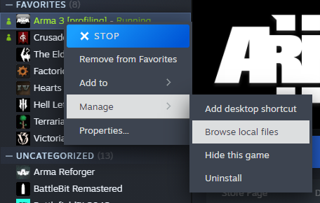
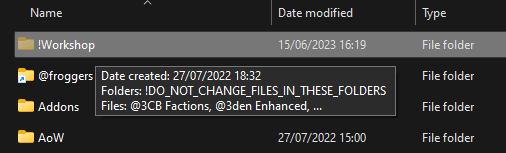
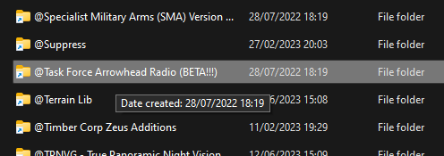
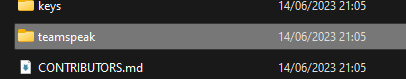
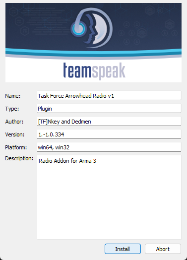
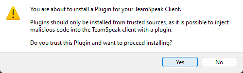

# How to install the TFAR TeamSpeak 3 Plugin

> Tip: You do not need to restart Arma 3 to install the plugin. You only need to restart TeamSpeak 3.

## Step 1: Subscribe to TaskForce Radio

Choose either the old one

- [task_force_radio](https://steamcommunity.com/sharedfiles/filedetails/?id=620019431)
- or the beta [Task Force Arrowhead Radio (BETA!!!)](https://steamcommunity.com/sharedfiles/filedetails/?id=894678801)

## Step 2: Navigate to your Arma 3 Folder

Right click on Arma 3 in your Steam Library and select `Manage` -> `Browse local files`.

## Step 3: Navigate to the TeamSpeak 3 Plugin Folder

### Quick way

- Old Mod: `Arma 3/!Workshop/@task_force_radio/teamspeak`
- Beta Mod: `Arma 3/!Workshop/@Task Force Arrowhead Radio (BETA!!!)/teamspeak`

### Step by Step

Open the `!Workshop` folder.

Open the `@task_force_radio` folder or `@Task Force Arrowhead Radio (BETA!!!)` folder.

Open the `teamspeak` folder.

## Step 4: Install the Plugin

1. Double click the `task_force_radio.ts3_plugin` file.
2. Click `Install`.

3. Click `Yes`.

4. TeamSpeak 3 will ask you to restart the application. Click `OK`.
